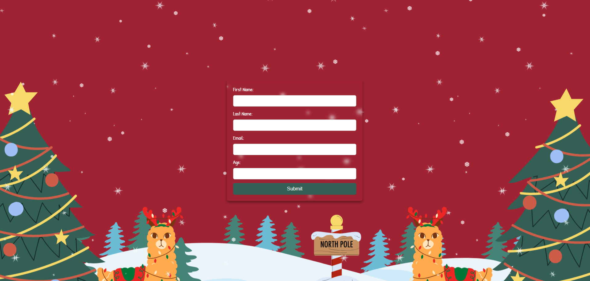

# UserManagement - Christmas Package Registration Application
**UserManagement** is an application built with Spring Boot that allows users to register for Christmas packages. The application provides user management features, role and address assignment, and an interactive API documentation interface using **Swagger UI**.

## Features
- **User Registration** - allows adding users with personal information (name, surname, email, age) and assigning roles and addresses.
- **User Management** - the ability to edit, delete, and view the list of users.
- **Roles and Addresses** - users can have different roles and addresses assigned.
- **Swagger UI** - interactive API documentation.

## Technologies
- **Java**
- **Spring Boot**
- **PostgreSQL**
- **Swagger UI**
- **Thymeleaf**
- **HTML**
- **CSS**
- **JavaScript**

## Sample Pages
### Homepage
Upon entering the site, users see a large *Claim your gift* button that redirects them to the registration form.

### Registration Form

A form where users provide their data: first name, last name, email, and age.

### Thank You Page

A page where users see a thank you message after completing the registration.

### Main Class
- **UserManagementApplication**: The main class that starts the Spring Boot application.

### Models
- **Role.java**: Represents the roles of users.
- **Address.java**: Stores user address information.
- **User.java**: Stores user data.

### Repositories
- **UserRepository**: Methods for searching users by name, age, email, etc.
- **RoleRepository**: Manages roles.
- **AddressRepository**: Manages addresses.

### Controllers
- **UserController**: Handles HTTP requests for users.
- **PageController**: Handles static pages such as the homepage and forms.

### Configuration
- **OpenAPIConfig**: Swagger settings for API documentation.
- **SecurityConfig**: Basic authentication configuration.
